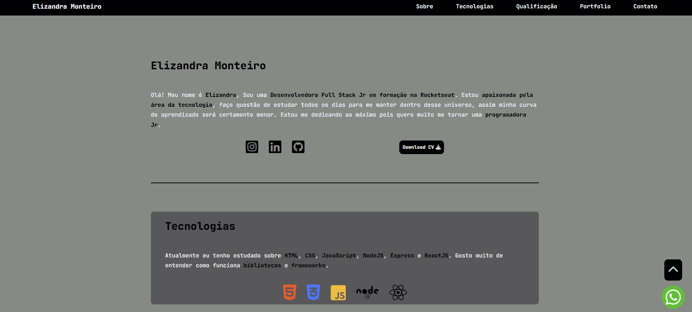

# Meu portfolio 

> Sobre o portfolio

Esse é meu portfolio, coloquei a barra de navegação do jeito tradicional na parte de cima. Uma rolagem suave de navegação entre as sessões, pelo JavaScript, adicionei um menu responsivo também, para aparecer dependendo do tamanho da tela. Selecionei uma paleta de cores que combinam entre si, gostei muito do resultado.

[🔗 Clique aqui para acessar](https://ElizandraMonteiro.github.io/portfolio)

## 🛠️ Tecnologias

- HTML
- CSS
- JavaScript

## 💛 Contato

monteiroelizandra2017@gmail.com